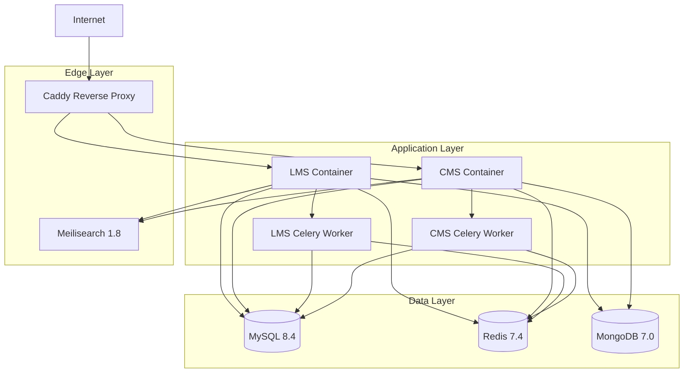

# Design Document - Open edX Simplification

## Overview

This design document outlines the technical approach for migrating from a Tutor-based Open edX deployment to a native Docker Compose setup. The goal is to reduce operational complexity while preserving all MVP functionality.

### Motivation: Why Move Away from Tutor?

**Context:** An initial deployment attempt was made using Tutor on Coolify (service alonu 2026). This deployment encountered critical configuration issues that blocked MVP delivery:

**Critical Errors Encountered:**

1. **MFE Configuration Error:**
   ```
   Module configuration error: SESSION_COOKIE_DOMAIN is required by ProcessEnvConfigService
   ```
   - Micro-frontends (MFEs) failed to load due to missing session cookie domain configuration
   - Tutor's automatic configuration generation didn't properly handle Coolify's domain setup
   - Manual override of Tutor-generated configs was complex and error-prone

2. **Authentication Failures:**
   ```
   lms.coolify.alonu.shop/login_refresh: Failed to load resource: 401 Unauthorized
   ```
   - Session cookies not shared correctly between LMS and MFEs
   - Cross-domain authentication broken due to Coolify proxy + Tutor abstraction layer
   - OAuth2 flow between Studio (CMS) and LMS failing intermittently

**Root Causes:**

1. **Abstraction Layer Mismatch:**
   - Tutor assumes control over reverse proxy (Caddy)
   - Coolify also provides reverse proxy (Traefik)
   - Double proxy layer caused domain/cookie issues

2. **Configuration Generation Opacity:**
   - Tutor generates configs automatically based on templates
   - Hard to debug which config value is wrong
   - Hard to override specific settings without breaking others

3. **MFE Complexity:**
   - MFEs require precise domain/cookie configuration
   - Tutor's MFE plugin adds another abstraction layer
   - Debugging requires understanding Tutor internals + Open edX + MFE configs

4. **Coolify Integration Friction:**
   - Coolify expects standard Docker Compose
   - Tutor uses custom orchestration logic
   - Environment variable injection conflicts

**Decision:** Move to native Docker Compose setup where:
- All configuration is explicit and visible
- No automatic generation that can fail silently
- Direct control over domain/cookie/proxy settings
- Standard Docker tooling compatible with Coolify
- Easier to debug: read config file = see actual config

**Trade-offs Accepted:**
- More manual configuration upfront (but only once)
- No Tutor plugin ecosystem (but MVP doesn't need it)
- Manual updates (but with clear control and testing)

**Expected Benefits:**
- SESSION_COOKIE_DOMAIN explicitly set in Django settings
- OAuth2 flow explicitly configured with correct redirect URIs
- Single reverse proxy (Caddy or Coolify's Traefik, not both)
- Debuggable: `cat config/lms/production.py` shows actual settings
- Coolify-compatible: standard docker-compose.yml

### Current Architecture (Tutor-based)

```
┌─────────────────────────────────────────────────────────────┐
│                        Tutor CLI                             │
│  (Configuration generation, plugin management, orchestration)│
└─────────────────────────────────────────────────────────────┘
                            │
                            ▼
┌─────────────────────────────────────────────────────────────┐
│              Generated Configuration Layer                   │
│  (Auto-generated settings, env files, docker-compose.yml)   │
└─────────────────────────────────────────────────────────────┘
                            │
                            ▼
┌─────────────────────────────────────────────────────────────┐
│                  Tutor Docker Images                         │
│         (overhangio/openedx with Tutor patches)             │
└─────────────────────────────────────────────────────────────┘
                            │
                            ▼
┌─────────────────────────────────────────────────────────────┐
│              Multiple Services + Plugins                     │
│  (LMS, CMS, MySQL, Redis, MongoDB, Elasticsearch, Caddy,    │
│   Forum, Analytics, SSO providers, etc.)                     │
└─────────────────────────────────────────────────────────────┘
```

**Challenges with current architecture:**
- Multiple abstraction layers make debugging difficult
- Configuration changes require Tutor rebuild process
- Plugin system adds complexity for features not needed in MVP
- Difficult to understand actual service configuration
- Tutor version upgrades can break custom configurations
- Over-provisioned services for MVP needs

### Target Architecture (Native Docker Compose)

```
┌─────────────────────────────────────────────────────────────┐
│                   docker-compose.yml                         │
│              (Direct service orchestration)                  │
└─────────────────────────────────────────────────────────────┘
                            │
                            ▼
┌─────────────────────────────────────────────────────────────┐
│              Configuration Files (mounted)                   │
│  (Django settings, uwsgi.ini, Caddyfile, .env)             │
└─────────────────────────────────────────────────────────────┘
                            │
                            ▼
┌─────────────────────────────────────────────────────────────┐
│                  Standard Docker Images                      │
│  (Official images + minimal Open edX custom build)          │
└─────────────────────────────────────────────────────────────┘
                            │
                            ▼
┌─────────────────────────────────────────────────────────────┐
│                  8 Core MVP Services                         │
│  LMS │ CMS │ MySQL │ Redis │ MongoDB │ Meilisearch │        │
│  Caddy │ Celery Workers                                      │
└─────────────────────────────────────────────────────────────┘
```

**Benefits of target architecture:**
- Direct control over all configuration
- No intermediate build/generation steps
- Standard Docker tooling only
- Minimal service footprint
- Clear separation of concerns
- Easy to debug and modify

### Design Principles

1. **Configuration over Code**: Prefer configuration changes over custom code modifications
2. **Minimal Viable Stack**: Include only services required for MVP functionality
3. **Standard Tooling**: Use official Docker images and standard Docker Compose
4. **Explicit over Implicit**: All configuration should be visible and editable
5. **Separation of Concerns**: Clear boundaries between services
6. **Security by Default**: Secrets management, HTTPS enforcement, minimal attack surface
7. **Operational Simplicity**: Easy to deploy, backup, restore, and debug

## Architecture

### Service Topology



### Service Descriptions

#### 1. LMS (Learning Management System)
- **Purpose**: Learner-facing application
- **Base Image**: `overhangio/openedx:palm.4` or custom build from `edx-platform`
- **Ports**: Internal 8000 (exposed via Caddy)
- **Dependencies**: MySQL, Redis, MongoDB, Meilisearch
- **Configuration**: Django settings mounted from `config/lms/`
- **Volumes**: Media files, static assets, application data

#### 2. CMS (Content Management System / Studio)
- **Purpose**: Content authoring interface
- **Base Image**: Same as LMS (different command)
- **Ports**: Internal 8001 (exposed via Caddy)
- **Dependencies**: MySQL, Redis, MongoDB, Meilisearch
- **Configuration**: Django settings mounted from `config/cms/`
- **Volumes**: Shared with LMS for media files

#### 3. MySQL 8.4
- **Purpose**: Primary relational database
- **Base Image**: `mysql:8.4`
- **Ports**: Internal 3306
- **Configuration**: Custom my.cnf for performance tuning
- **Volumes**: Database data persistence
- **Optimization**: Query cache, connection pooling, InnoDB buffer pool

#### 4. Redis 7.4
- **Purpose**: Caching, session storage, Celery message broker
- **Base Image**: `redis:7.4-alpine`
- **Ports**: Internal 6379
- **Configuration**: redis.conf for persistence and memory limits
- **Volumes**: Optional persistence for cache durability

#### 5. MongoDB 7.0
- **Purpose**: Content metadata and modulestore
- **Base Image**: `mongo:7.0`
- **Ports**: Internal 27017
- **Configuration**: mongod.conf for replication set (single node)
- **Volumes**: Database data persistence

#### 6. Meilisearch 1.8
- **Purpose**: Course and content search
- **Base Image**: `getmeili/meilisearch:v1.8`
- **Ports**: Internal 7700
- **Configuration**: Environment variables for API key
- **Volumes**: Search index persistence

#### 7. Caddy 2.7
- **Purpose**: Reverse proxy, HTTPS termination, static file serving
- **Base Image**: `caddy:2.7-alpine`
- **Ports**: 80 (HTTP), 443 (HTTPS)
- **Configuration**: Caddyfile for routing and TLS
- **Features**: Automatic HTTPS, compression, caching headers
**Key Django Settings:**

**Session and Cookie Configuration (fixes Coolify issues):**
```python
# config/lms/production.py

# CRITICAL: Explicitly set for MFE compatibility
SESSION_COOKIE_DOMAIN = '.alonu.shop'  # Allows cookies across lms.alonu.shop and studio.alonu.shop
SESSION_COOKIE_NAME = 'openedx_sessionid'
SESSION_COOKIE_SECURE = True  # HTTPS only
SESSION_COOKIE_HTTPONLY = True  # Prevent XSS
SESSION_COOKIE_SAMESITE = 'Lax'  # Allow cross-subdomain

# CSRF protection with cross-domain support
CSRF_COOKIE_DOMAIN = '.alonu.shop'
CSRF_COOKIE_SECURE = True
CSRF_TRUSTED_ORIGINS = [
    'https://lms.alonu.shop',
    'https://studio.alonu.shop',
]

# OAuth2 for CMS-LMS communication
SOCIAL_AUTH_EDX_OAUTH2_KEY = 'studio-sso-key'
SOCIAL_AUTH_EDX_OAUTH2_SECRET = os.environ['STUDIO_SSO_SECRET']
SOCIAL_AUTH_EDX_OAUTH2_URL_ROOT = 'https://lms.alonu.shop'
SOCIAL_AUTH_EDX_OAUTH2_PUBLIC_URL_ROOT = 'https://lms.alonu.shop'

# Correct redirect URIs (fixes 401 errors)
LOGIN_REDIRECT_URL = 'https://lms.alonu.shop/dashboard'
SOCIAL_AUTH_EDX_OAUTH2_REDIRECT_URI = 'https://studio.alonu.shop/complete/edx-oauth2/'
```

**Authentication & Authorization:**
#### 8. Celery Workers (LMS + CMS)
- **Purpose**: Asynchronous task processing
- **Base Image**: Same as LMS/CMS
- **Command**: `celery worker`
- **Dependencies**: Redis (broker), MySQL, MongoDB
- **Tasks**: Email sending, certificate generation, content indexing, exports

### Network Architecture

```yaml
networks:
  openedx:
    driver: bridge
    ipam:
      config:
        - subnet: 172.20.0.0/16
```

All services communicate via the `openedx` bridge network. Service discovery uses Docker DNS (service names as hostnames).

### Volume Strategy

**Named Volumes (Production):**
- `mysql_data`: MySQL database files
- `mongo_data`: MongoDB database files
- `redis_data`: Redis persistence (optional)
- `meilisearch_data`: Search index
- `openedx_media`: Uploaded media files (videos, PDFs, images)
- `openedx_data`: Application data (certificates, exports)

**Bind Mounts (Development):**
- `./config/lms:/openedx/config/lms:ro` - LMS configuration
- `./config/cms:/openedx/config/cms:ro` - CMS configuration
- `./config/caddy:/etc/caddy:ro` - Caddy configuration
- `./edx-platform:/openedx/edx-platform` - Source code (dev only)

## Components and Interfaces

### Configuration Layer

#### Django Settings Structure

```
config/
├── lms/
│   ├── production.py          # Production settings
│   ├── development.py         # Development settings
│   ├── common.py              # Shared settings
│   └── uwsgi.ini              # uWSGI configuration
├── cms/
│   ├── production.py
│   ├── development.py
│   ├── common.py
│   └── uwsgi.ini
├── caddy/
│   └── Caddyfile              # Reverse proxy configuration
└── mysql/
    └── my.cnf                 # MySQL optimization
```

#### Key Django Settings

**Authentication & Authorization:**
```python
# config/lms/common.py
AUTHENTICATION_BACKENDS = [
    'django.contrib.auth.backends.ModelBackend',
    # SSO backends removed for MVP
]

FEATURES = {
    'ENABLE_OAUTH2_PROVIDER': False,  # V2 feature
    'ENABLE_THIRD_PARTY_AUTH': False,  # V2 feature
    'ENABLE_COMBINED_LOGIN_REGISTRATION': True,
    'ENABLE_GRADE_DOWNLOADS': True,
    'ENABLE_INSTRUCTOR_EMAIL': True,
    'ENABLE_CERTIFICATES': True,
    'ENABLE_COHORTS': True,
    'ENABLE_COURSE_DISCOVERY': False,  # Using Meilisearch
    'ENABLE_DISCUSSION_SERVICE': False,  # Forums disabled for MVP
    'ENABLE_SCORM': False,  # V2 feature
    'ENABLE_XAPI': False,  # V2 feature
}
```

**Minimal INSTALLED_APPS:**
```python
INSTALLED_APPS = [
    # Django core
    'django.contrib.admin',
    'django.contrib.auth',
    'django.contrib.contenttypes',
    'django.contrib.sessions',
    'django.contrib.messages',
    'django.contrib.staticfiles',
    
    # Open edX core (MVP required)
    'openedx.core.djangoapps.user_api',
    'openedx.core.djangoapps.site_configuration',
    'openedx.core.djangoapps.content.course_overviews',
    'openedx.core.djangoapps.content.block_structure',
    'openedx.core.djangoapps.enrollments',
    
    # LMS apps (MVP required)
    'lms.djangoapps.courseware',
    'lms.djangoapps.certificates',
    'lms.djangoapps.grades',
    'lms.djangoapps.instructor',
    'lms.djangoapps.instructor_task',
    'lms.djangoapps.course_groups',  # Cohorts
    'lms.djangoapps.bulk_email',
    'lms.djangoapps.verify_student',
    
    # CMS apps (MVP required)
    'cms.djangoapps.contentstore',
    'cms.djangoapps.course_creators',
    
    # Third-party (MVP required)
    'rest_framework',
    'django_celery_results',
    'storages',  # For media file handling
    
    # REMOVED for MVP (V2 features):
    # 'lms.djangoapps.discussion',  # Forums
    # 'django_comment_client',  # Forums
    # 'lms.djangoapps.teams',  # Community teams
    # 'social_django',  # SSO
    # 'edx_proctoring',  # Advanced proctoring
]
```

**Database Configuration:**
```python
DATABASES = {
    'default': {
        'ENGINE': 'django.db.backends.mysql',
        'NAME': os.environ['MYSQL_DATABASE'],
        'USER': os.environ['MYSQL_USER'],
        'PASSWORD': os.environ['MYSQL_PASSWORD'],
        'HOST': 'mysql',  # Docker service name
        'PORT': '3306',
        'OPTIONS': {
            'init_command': "SET sql_mode='STRICT_TRANS_TABLES'",
            'charset': 'utf8mb4',
        },
        'CONN_MAX_AGE': 600,  # Connection pooling
    }
}

# MongoDB for modulestore
CONTENTSTORE = {
    'ENGINE': 'xmodule.contentstore.mongo.MongoContentStore',
    'DOC_STORE_CONFIG': {
        'host': 'mongodb',
        'port': 27017,
        'db': os.environ['MONGO_DATABASE'],
        'user': os.environ['MONGO_USER'],
        'password': os.environ['MONGO_PASSWORD'],
    }
}
```

**Caching Configuration:**
```python
CACHES = {
    'default': {
        'BACKEND': 'django_redis.cache.RedisCache',
        'LOCATION': 'redis://redis:6379/0',
        'OPTIONS': {
            'CLIENT_CLASS': 'django_redis.client.DefaultClient',
            'CONNECTION_POOL_KWARGS': {
                'max_connections': 50,
            }
        },
        'KEY_PREFIX': 'openedx',
        'TIMEOUT': 300,
    }
}

SESSION_ENGINE = 'django.contrib.sessions.backends.cache'
SESSION_CACHE_ALIAS = 'default'
```

**Celery Configuration:**
```python
CELERY_BROKER_URL = 'redis://redis:6379/1'
CELERY_RESULT_BACKEND = 'django-db'
CELERY_TASK_ALWAYS_EAGER = False
CELERY_TASK_SERIALIZER = 'json'
CELERY_RESULT_SERIALIZER = 'json'
CELERY_ACCEPT_CONTENT = ['json']
CELERY_TIMEZONE = 'UTC'
```

#### Caddyfile Configuration

```caddyfile
# config/caddy/Caddyfile

{
    email admin@example.com
    # Automatic HTTPS
}

# LMS (learner interface)
lms.example.com {
    reverse_proxy lms:8000 {
        header_up X-Forwarded-Proto {scheme}
        header_up X-Forwarded-For {remote}
    }
    
    # Static files
    handle /static/* {
        root * /openedx/staticfiles
        file_server
    }
    
    # Media files
    handle /media/* {
        root * /openedx/media
        file_server
    }
    
    # Compression
    encode gzip zstd
    
    # Security headers
    header {
        Strict-Transport-Security "max-age=31536000; includeSubDomains"
        X-Content-Type-Options "nosniff"
        X-Frame-Options "SAMEORIGIN"
        X-XSS-Protection "1; mode=block"
    }
    
    # Logging
    log {
        output file /var/log/caddy/lms-access.log
    }
}

# CMS (Studio)
studio.example.com {
    reverse_proxy cms:8001 {
        header_up X-Forwarded-Proto {scheme}
        header_up X-Forwarded-For {remote}
    }
    
    handle /static/* {
        root * /openedx/staticfiles
        file_server
    }
    
    handle /media/* {
        root * /openedx/media
        file_server
    }
    
    encode gzip zstd
    
    header {
        Strict-Transport-Security "max-age=31536000; includeSubDomains"
        X-Content-Type-Options "nosniff"
        X-Frame-Options "SAMEORIGIN"
        X-XSS-Protection "1; mode=block"
    }
    
    log {
        output file /var/log/caddy/cms-access.log
    }
}
```

#### Environment Variables

```bash
# .env.example

# Environment
ENVIRONMENT=production  # or development

# MySQL
MYSQL_ROOT_PASSWORD=<generate-strong-password>
MYSQL_DATABASE=openedx
MYSQL_USER=openedx
MYSQL_PASSWORD=<generate-strong-password>

# MongoDB
MONGO_DATABASE=openedx
MONGO_USER=openedx
MONGO_PASSWORD=<generate-strong-password>

# Redis
REDIS_PASSWORD=<generate-strong-password>

# Meilisearch
MEILI_MASTER_KEY=<generate-strong-password>

# Django
SECRET_KEY=<generate-django-secret-key>
ALLOWED_HOSTS=lms.example.com,studio.example.com

# Email (SMTP)
EMAIL_HOST=smtp.example.com
EMAIL_PORT=587
EMAIL_HOST_USER=noreply@example.com
EMAIL_HOST_PASSWORD=<smtp-password>
EMAIL_USE_TLS=true

# Localization
LANGUAGE_CODE=fr
TIME_ZONE=Europe/Paris

# Platform URLs
LMS_ROOT_URL=https://lms.example.com
CMS_ROOT_URL=https://studio.example.com

# Feature flags
ENABLE_CERTIFICATES=true
ENABLE_COHORTS=true
ENABLE_BULK_EMAIL=true
```

### Docker Compose Structure

```yaml
# docker-compose.yml
version: '3.8'

services:
  mysql:
    image: mysql:8.4
    container_name: openedx-mysql
    environment:
      MYSQL_ROOT_PASSWORD: ${MYSQL_ROOT_PASSWORD}
      MYSQL_DATABASE: ${MYSQL_DATABASE}
      MYSQL_USER: ${MYSQL_USER}
      MYSQL_PASSWORD: ${MYSQL_PASSWORD}
    volumes:
      - mysql_data:/var/lib/mysql
      - ./config/mysql/my.cnf:/etc/mysql/conf.d/custom.cnf:ro
    networks:
      - openedx
    restart: unless-stopped
    healthcheck:
      test: ["CMD", "mysqladmin", "ping", "-h", "localhost"]
      interval: 10s
      timeout: 5s
      retries: 5

  mongodb:
    image: mongo:7.0
    container_name: openedx-mongodb
    environment:
      MONGO_INITDB_ROOT_USERNAME: ${MONGO_USER}
      MONGO_INITDB_ROOT_PASSWORD: ${MONGO_PASSWORD}
      MONGO_INITDB_DATABASE: ${MONGO_DATABASE}
    volumes:
      - mongo_data:/data/db
    networks:
      - openedx
    restart: unless-stopped
    command: mongod --replSet rs0
    healthcheck:
      test: ["CMD", "mongosh", "--eval", "db.adminCommand('ping')"]
      interval: 10s
      timeout: 5s
      retries: 5

  redis:
    image: redis:7.4-alpine
    container_name: openedx-redis
    command: redis-server --requirepass ${REDIS_PASSWORD} --appendonly yes
    volumes:
      - redis_data:/data
    networks:
      - openedx
    restart: unless-stopped
    healthcheck:
      test: ["CMD", "redis-cli", "ping"]
      interval: 10s
      timeout: 5s
      retries: 5

  meilisearch:
    image: getmeili/meilisearch:v1.8
    container_name: openedx-meilisearch
    environment:
      MEILI_MASTER_KEY: ${MEILI_MASTER_KEY}
      MEILI_ENV: production
    volumes:
      - meilisearch_data:/meili_data
    networks:
      - openedx
    restart: unless-stopped
    healthcheck:
      test: ["CMD", "curl", "-f", "http://localhost:7700/health"]
      interval: 10s
      timeout: 5s
      retries: 5

  lms:
    image: overhangio/openedx:palm.4
    container_name: openedx-lms
    environment:
      SERVICE_VARIANT: lms
      DJANGO_SETTINGS_MODULE: lms.envs.production
    env_file:
      - .env
    volumes:
      - ./config/lms:/openedx/config:ro
      - openedx_media:/openedx/media
      - openedx_data:/openedx/data
      - openedx_static:/openedx/staticfiles
    networks:
      - openedx
    depends_on:
      mysql:
        condition: service_healthy
      mongodb:
        condition: service_healthy
      redis:
        condition: service_healthy
      meilisearch:
        condition: service_healthy
    restart: unless-stopped
    command: uwsgi --ini /openedx/config/uwsgi.ini

  cms:
    image: overhangio/openedx:palm.4
    container_name: openedx-cms
    environment:
      SERVICE_VARIANT: cms
      DJANGO_SETTINGS_MODULE: cms.envs.production
    env_file:
      - .env
    volumes:
      - ./config/cms:/openedx/config:ro
      - openedx_media:/openedx/media
      - openedx_data:/openedx/data
      - openedx_static:/openedx/staticfiles
    networks:
      - openedx
    depends_on:
      mysql:
        condition: service_healthy
      mongodb:
        condition: service_healthy
      redis:
        condition: service_healthy
      meilisearch:
        condition: service_healthy
    restart: unless-stopped
    command: uwsgi --ini /openedx/config/uwsgi.ini

  lms-worker:
    image: overhangio/openedx:palm.4
    container_name: openedx-lms-worker
    environment:
      SERVICE_VARIANT: lms
      DJANGO_SETTINGS_MODULE: lms.envs.production
      C_FORCE_ROOT: "1"
    env_file:
      - .env
    volumes:
      - ./config/lms:/openedx/config:ro
      - openedx_media:/openedx/media
      - openedx_data:/openedx/data
    networks:
      - openedx
    depends_on:
      - lms
      - redis
    restart: unless-stopped
    command: celery -A lms.celery worker --loglevel=info --max-tasks-per-child=100

  cms-worker:
    image: overhangio/openedx:palm.4
    container_name: openedx-cms-worker
    environment:
      SERVICE_VARIANT: cms
      DJANGO_SETTINGS_MODULE: cms.envs.production
      C_FORCE_ROOT: "1"
    env_file:
      - .env
    volumes:
      - ./config/cms:/openedx/config:ro
      - openedx_media:/openedx/media
      - openedx_data:/openedx/data
    networks:
      - openedx
    depends_on:
      - cms
      - redis
    restart: unless-stopped
    command: celery -A cms.celery worker --loglevel=info --max-tasks-per-child=100

  caddy:
    image: caddy:2.7-alpine
    container_name: openedx-caddy
    ports:
      - "80:80"
      - "443:443"
    volumes:
      - ./config/caddy/Caddyfile:/etc/caddy/Caddyfile:ro
      - caddy_data:/data
      - caddy_config:/config
      - openedx_static:/openedx/staticfiles:ro
      - openedx_media:/openedx/media:ro
    networks:
      - openedx
    depends_on:
      - lms
      - cms
    restart: unless-stopped

volumes:
  mysql_data:
  mongo_data:
  redis_data:
  meilisearch_data:
  openedx_media:
  openedx_data:
  openedx_static:
  caddy_data:
  caddy_config:

networks:
  openedx:
    driver: bridge
```

### Interface Contracts

#### LMS ↔ MySQL
- **Protocol**: MySQL wire protocol (TCP)
- **Port**: 3306
- **Authentication**: Username/password from environment
- **Connection Pooling**: Django CONN_MAX_AGE=600
- **Data**: User accounts, enrollments, grades, certificates, course metadata

#### LMS ↔ MongoDB
- **Protocol**: MongoDB wire protocol (TCP)
- **Port**: 27017
- **Authentication**: Username/password from environment
- **Data**: Course content (modulestore), XBlocks, course structure

#### LMS ↔ Redis
- **Protocol**: Redis protocol (TCP)
- **Port**: 6379
- **Authentication**: Password from environment
- **Usage**: Session cache, application cache, Celery broker

#### LMS ↔ Meilisearch
- **Protocol**: HTTP REST API
- **Port**: 7700
- **Authentication**: API key from environment
- **Usage**: Course search, content discovery

#### Caddy ↔ LMS/CMS
- **Protocol**: HTTP/1.1
- **Ports**: LMS 8000, CMS 8001
- **Headers**: X-Forwarded-Proto, X-Forwarded-For
- **Static Files**: Served directly by Caddy from shared volumes

#### Celery Workers ↔ Redis
- **Protocol**: Redis protocol (message broker)
- **Queue Names**: `lms.default`, `cms.default`
- **Task Serialization**: JSON

## Data Models

### Volume Data Organization

```
openedx_media/
├── profile_images/          # User profile pictures
├── course_assets/           # Course images, videos
├── certificates/            # Generated PDF certificates
└── uploads/                 # User-uploaded files (assignments)

openedx_data/
├── exports/                 # Course exports
├── imports/                 # Course imports
└── logs/                    # Application logs (if file-based)

mysql_data/
└── openedx/                 # MySQL database files
    ├── auth_user           # User accounts
    ├── student_courseenrollment  # Enrollments
    ├── certificates_generatedcertificate  # Certificate records
    ├── grades_persistentcoursegrade  # Final grades
    └── ...                 # Other Django tables

mongo_data/
└── openedx/                 # MongoDB database
    ├── modulestore         # Course structure
    ├── fs.files            # GridFS file metadata
    └── fs.chunks           # GridFS file chunks
```

### Configuration Data Model

```
config/
├── lms/
│   ├── production.py       # Django settings (Python)
│   ├── development.py
│   ├── common.py
│   └── uwsgi.ini           # uWSGI config (INI)
├── cms/
│   ├── production.py
│   ├── development.py
│   ├── common.py
│   └── uwsgi.ini
├── caddy/
│   └── Caddyfile           # Caddy config (Caddyfile syntax)
└── mysql/
    └── my.cnf              # MySQL config (INI)
```

### Migration Data Mapping

| Tutor Location | Native Location | Migration Method |
|----------------|-----------------|------------------|
| `$(tutor config printroot)/data/mysql` | `mysql_data` volume | `mysqldump` + `mysql` import |
| `$(tutor config printroot)/data/mongodb` | `mongo_data` volume | `mongodump` + `mongorestore` |
| `$(tutor config printroot)/data/lms` | `openedx_media` volume | `rsync` or `cp -a` |
| `$(tutor config printroot)/data/cms` | `openedx_media` volume | `rsync` or `cp -a` |
| `$(tutor config printroot)/env/apps/openedx/settings/lms/production.py` | `config/lms/production.py` | Manual conversion |
| `$(tutor config printroot)/env/apps/caddy/Caddyfile` | `config/caddy/Caddyfile` | Manual conversion |


## Disabled Features Documentation

### DISABLED_FEATURES.md Structure

The native setup will include a `DISABLED_FEATURES.md` file documenting all disabled V2 features:

```markdown
# Disabled Features for MVP

This document lists Open edX features disabled in the MVP configuration and how to re-enable them for V2.

## Forums and Discussions

**Disabled Apps:**
- `lms.djangoapps.discussion`
- `django_comment_client`
- `lms.djangoapps.django_comment_common`

**Disabled Features:**
```python
FEATURES['ENABLE_DISCUSSION_SERVICE'] = False
```

**Re-enable for V2:**
1. Add apps back to INSTALLED_APPS
2. Set ENABLE_DISCUSSION_SERVICE = True
3. Deploy forum service (cs_comments_service)
4. Configure FORUM_API_URL

**Dependencies:** Ruby-based forum service, Elasticsearch

---

## SSO Providers (Google, Microsoft, SAML)

**Disabled Apps:**
- `social_django`
- `common.djangoapps.third_party_auth`

**Disabled Backends:**
```python
# Removed from AUTHENTICATION_BACKENDS:
# 'social_core.backends.google.GoogleOAuth2'
# 'social_core.backends.azuread.AzureADOAuth2'
# 'common.djangoapps.third_party_auth.saml.SAMLAuthBackend'
```

**Re-enable for V2:**
1. Add social_django to INSTALLED_APPS
2. Add third_party_auth to INSTALLED_APPS
3. Configure OAuth2 credentials
4. Add authentication backends
5. Run migrations for social_auth tables

---

## SCORM and xAPI

**Disabled Features:**
```python
FEATURES['ENABLE_SCORM'] = False
FEATURES['ENABLE_XAPI'] = False
```

**Disabled Apps:**
- `openedx.features.course_experience` (SCORM components)

**Re-enable for V2:**
1. Set feature flags to True
2. Install SCORM XBlock
3. Configure xAPI endpoint if needed

---

## Advanced Analytics

**Disabled Apps:**
- `edx_analytics_dashboard` integrations
- `lms.djangoapps.analytics`

**Re-enable for V2:**
1. Deploy analytics pipeline (separate service)
2. Add analytics apps to INSTALLED_APPS
3. Configure ANALYTICS_DASHBOARD_URL

**Dependencies:** Hadoop/Spark analytics pipeline

---

## Video Conferencing (Zoom, Teams)

**Disabled Apps:**
- Zoom LTI plugin
- Microsoft Teams integration

**Re-enable for V2:**
1. Install video conferencing XBlock
2. Configure LTI credentials
3. Add to INSTALLED_APPS

---

## Community Features

**Disabled Apps:**
- `lms.djangoapps.teams` (if not used for cohorts)
- `wiki` (if not needed)

**Re-enable for V2:**
1. Add apps to INSTALLED_APPS
2. Run migrations
3. Configure team settings

---

## Dependency Analysis

Each disabled feature was analyzed for MVP dependencies:

| Feature | MVP Dependencies | Safe to Disable |
|---------|------------------|-----------------|
| Forums | None (announcements use bulk_email) | ✅ Yes |
| SSO | None (basic auth sufficient) | ✅ Yes |
| SCORM | None (using native XBlocks) | ✅ Yes |
| xAPI | None (basic grading sufficient) | ✅ Yes |
| Advanced Analytics | None (basic reporting sufficient) | ✅ Yes |
| Video Conferencing | None (async learning model) | ✅ Yes |
| Teams | None (cohorts handle grouping) | ✅ Yes |
| Wiki | None (using course pages) | ✅ Yes |
```

### Feature Flag Configuration

```python
# config/lms/common.py - MVP Feature Flags

FEATURES = {
    # MVP ENABLED Features
    'ENABLE_COMBINED_LOGIN_REGISTRATION': True,
    'ENABLE_GRADE_DOWNLOADS': True,
    'ENABLE_INSTRUCTOR_EMAIL': True,
    'ENABLE_CERTIFICATES': True,
    'ENABLE_COHORTS': True,
    'ENABLE_COURSE_GROUPS': True,
    'ENABLE_BULK_EMAIL': True,
    'ENABLE_INSTRUCTOR_ANALYTICS': True,  # Basic analytics
    'ENABLE_STUDENT_NOTES': True,
    'ENABLE_EDXNOTES': True,
    'ENABLE_PREREQUISITE_COURSES': True,
    'ENABLE_ENTRANCE_EXAMS': True,
    'ENABLE_SPECIAL_EXAMS': True,  # Timed/proctored exams
    'ENABLE_PROCTORED_EXAMS': False,  # Advanced proctoring disabled
    
    # MVP DISABLED Features (V2)
    'ENABLE_DISCUSSION_SERVICE': False,  # Forums
    'ENABLE_OAUTH2_PROVIDER': False,  # SSO
    'ENABLE_THIRD_PARTY_AUTH': False,  # SSO
    'ENABLE_SCORM': False,
    'ENABLE_XAPI': False,
    'ENABLE_COURSE_DISCOVERY': False,  # Using Meilisearch instead
    'ENABLE_TEAMS': False,  # Community teams
    'ENABLE_WIKI': False,
    'ENABLE_VIDEO_UPLOAD_PIPELINE': False,  # Using direct upload
    'ENABLE_MOBILE_REST_API': True,  # Keep for mobile-first
}
```

## Migration Strategy

### Phase 1: Preparation (Pre-Migration)

1. **Audit Current Tutor Setup**
   ```bash
   # Document current configuration
   tutor config printroot
   tutor config save --output tutor-config-backup.yml
   
   # List running services
   tutor local status
   
   # Check data volumes
   docker volume ls | grep tutor
   ```

2. **Backup Everything**
   ```bash
   # MySQL backup
   tutor local exec mysql mysqldump --all-databases > mysql-backup.sql
   
   # MongoDB backup
   tutor local exec mongodb mongodump --out=/tmp/mongo-backup
   docker cp tutor_mongodb_1:/tmp/mongo-backup ./mongo-backup
   
   # Media files backup
   docker cp tutor_lms_1:/openedx/media ./media-backup
   docker cp tutor_cms_1:/openedx/data ./data-backup
   
   # Configuration backup
   cp -r $(tutor config printroot) ./tutor-config-backup
   ```

3. **Document Custom Configurations**
   - List all Tutor plugins: `tutor plugins list`
   - Document custom patches
   - Document environment-specific settings
   - Document integrations (SMTP, storage, etc.)

### Phase 2: Native Setup Preparation

1. **Create Directory Structure**
   ```bash
   mkdir -p openedx-native/{config/{lms,cms,caddy,mysql},scripts,docs}
   cd openedx-native
   ```

2. **Convert Configuration**
   - Map Tutor settings to native Django settings
   - Convert Tutor Caddyfile to native Caddyfile
   - Extract secrets to .env file
   - Create docker-compose.yml

3. **Initialize Volumes**
   ```bash
   # Create named volumes
   docker volume create openedx_mysql_data
   docker volume create openedx_mongo_data
   docker volume create openedx_redis_data
   docker volume create openedx_meilisearch_data
   docker volume create openedx_media
   docker volume create openedx_data
   ```

### Phase 3: Data Migration

1. **Stop Tutor Services**
   ```bash
   tutor local stop
   ```

2. **Migrate MySQL**
   ```bash
   # Start only MySQL in native setup
   docker-compose up -d mysql
   
   # Wait for MySQL to be ready
   docker-compose exec mysql mysqladmin ping
   
   # Import data
   docker-compose exec -T mysql mysql -u root -p${MYSQL_ROOT_PASSWORD} < mysql-backup.sql
   
   # Verify
   docker-compose exec mysql mysql -u root -p${MYSQL_ROOT_PASSWORD} -e "SHOW DATABASES;"
   ```

3. **Migrate MongoDB**
   ```bash
   # Start MongoDB
   docker-compose up -d mongodb
   
   # Initialize replica set (required by Open edX)
   docker-compose exec mongodb mongosh --eval "rs.initiate()"
   
   # Restore data
   docker cp ./mongo-backup openedx-mongodb:/tmp/
   docker-compose exec mongodb mongorestore /tmp/mongo-backup
   
   # Verify
   docker-compose exec mongodb mongosh --eval "db.adminCommand('listDatabases')"
   ```

4. **Migrate Media Files**
   ```bash
   # Copy to volume
   docker run --rm -v openedx_media:/target -v $(pwd)/media-backup:/source alpine cp -a /source/. /target/
   docker run --rm -v openedx_data:/target -v $(pwd)/data-backup:/source alpine cp -a /source/. /target/
   ```

### Phase 4: Service Startup

1. **Start Infrastructure Services**
   ```bash
   docker-compose up -d redis meilisearch
   ```

2. **Run Migrations**
   ```bash
   # LMS migrations
   docker-compose run --rm lms python manage.py lms migrate --settings=lms.envs.production
   
   # CMS migrations
   docker-compose run --rm cms python manage.py cms migrate --settings=cms.envs.production
   ```

3. **Collect Static Files**
   ```bash
   docker-compose run --rm lms python manage.py lms collectstatic --noinput --settings=lms.envs.production
   docker-compose run --rm cms python manage.py cms collectstatic --noinput --settings=cms.envs.production
   ```

4. **Start Application Services**
   ```bash
   docker-compose up -d lms cms lms-worker cms-worker caddy
   ```

### Phase 5: Validation

1. **Health Checks**
   ```bash
   # Check all services are running
   docker-compose ps
   
   # Check logs for errors
   docker-compose logs --tail=100
   
   # Test database connectivity
   docker-compose exec lms python manage.py lms check --settings=lms.envs.production
   ```

2. **Functional Tests**
   - Login as existing user
   - Enroll in existing course
   - View course content
   - Submit assignment
   - Generate certificate
   - Send test email

3. **Data Integrity Checks**
   ```bash
   # Count users
   docker-compose exec mysql mysql -u openedx -p${MYSQL_PASSWORD} openedx -e "SELECT COUNT(*) FROM auth_user;"
   
   # Count enrollments
   docker-compose exec mysql mysql -u openedx -p${MYSQL_PASSWORD} openedx -e "SELECT COUNT(*) FROM student_courseenrollment;"
   
   # Count courses
   docker-compose exec mongodb mongosh openedx --eval "db.modulestore.active_versions.count()"
   ```

### Phase 6: Rollback Plan

If migration fails:

1. **Stop Native Setup**
   ```bash
   docker-compose down
   ```

2. **Restart Tutor**
   ```bash
   tutor local start
   ```

3. **Restore from Backup** (if data was corrupted)
   ```bash
   # Restore MySQL
   tutor local exec mysql mysql -u root -p < mysql-backup.sql
   
   # Restore MongoDB
   tutor local exec mongodb mongorestore /tmp/mongo-backup
   ```

### Migration Checklist

- [ ] Tutor configuration documented
- [ ] Full backup completed and verified
- [ ] Native configuration files created
- [ ] .env file populated with secrets
- [ ] docker-compose.yml validated
- [ ] MySQL data migrated and verified
- [ ] MongoDB data migrated and verified
- [ ] Media files migrated and verified
- [ ] Database migrations run successfully
- [ ] Static files collected
- [ ] All services started
- [ ] Health checks passed
- [ ] User login tested
- [ ] Course access tested
- [ ] Certificate generation tested
- [ ] Email sending tested
- [ ] Performance baseline established
- [ ] Monitoring configured
- [ ] Backup procedures documented
- [ ] Rollback plan tested

## Security Considerations

### Secrets Management

1. **Never Commit Secrets**
   - Add `.env` to `.gitignore`
   - Use `.env.example` as template
   - Document secret generation procedures

2. **Secret Generation**
   ```bash
   # Django SECRET_KEY
   python -c "from django.core.management.utils import get_random_secret_key; print(get_random_secret_key())"
   
   # MySQL passwords
   openssl rand -base64 32
   
   # Meilisearch master key
   openssl rand -base64 32
   ```

3. **Secret Rotation**
   - Document rotation procedures for each secret
   - Test rotation in development first
   - Plan for zero-downtime rotation (connection draining)

### Network Security

1. **Service Isolation**
   - All services on private `openedx` network
   - Only Caddy exposes ports to host
   - No direct database access from outside

2. **HTTPS Enforcement**
   - Caddy automatic HTTPS with Let's Encrypt
   - HSTS headers enabled
   - HTTP → HTTPS redirect

3. **Security Headers**
   - X-Content-Type-Options: nosniff
   - X-Frame-Options: SAMEORIGIN
   - X-XSS-Protection: 1; mode=block
   - Strict-Transport-Security

### Access Control

1. **Database Access**
   - Separate user accounts per service
   - Minimal privileges (no GRANT, DROP)
   - Strong passwords (32+ characters)

2. **Admin Access**
  
## Correctness Properties

*A property is a characteristic or behavior that should hold true across all valid executions of a system—essentially, a formal statement about what the system should do. Properties serve as the bridge between human-readable specifications and machine-verifiable correctness guarantees.*

### Property 1: Tutor Independence

*For any* deployment operation (start, stop, restart, configure), the native setup should complete successfully using only docker-compose commands without requiring Tutor binaries, Tutor-generated configuration files, or Tutor plugins.

**Validates: Requirements 1.1, 1.2, 1.3, 1.4**

### Property 2: Configuration Editability

*For any* configuration file modification (Django settings, uwsgi.ini, Caddyfile), applying the change should require only a container restart without any rebuild or regeneration step.

**Validates: Requirements 1.5, 5.4**

### Property 3: MVP Service Completeness

*For any* valid docker-compose.yml file, it should define exactly the 8 MVP services (LMS, CMS, MySQL 8.4, Redis 7.4, MongoDB 7.0, Meilisearch 1.8, Caddy, and Celery workers for LMS and CMS) with no additional V2 services (forums, analytics, SSO providers).

**Validates: Requirements 2.1, 3.1, 3.2, 3.3, 3.4, 3.5, 3.6, 3.7, 3.8, 3.9**

### Property 4: Official Image Usage

*For any* service in docker-compose.yml (except Open edX application services), the image should be from official Docker Hub repositories (mysql:8.4, redis:7.4, mongo:7.0, getmeili/meilisearch:v1.8, caddy:2.7).

**Validates: Requirements 2.2, 4.1, 4.2, 4.3, 4.4, 4.5, 4.6**

### Property 5: Open edX Image Consistency

*For any* Open edX application service (LMS, CMS, lms-worker, cms-worker), the image should be either overhangio/openedx or a documented custom build, and all four services should use the same image.

**Validates: Requirements 4.7, 4.8, 8.5**

### Property 6: Minimal Port Exposure

*For any* service in docker-compose.yml, only the Caddy service should expose ports to the host (80, 443), while all other services should communicate via the internal Docker network.

**Validates: Requirements 2.3**

### Property 7: Service Dependency Declaration

*For any* application service (LMS, CMS, workers), it should have explicit depends_on entries for all required infrastructure services (MySQL, MongoDB, Redis, Meilisearch).

**Validates: Requirements 2.4**

### Property 8: Named Volume Usage

*For any* data volume in docker-compose.yml, it should be a named volume (not anonymous) to ensure data persistence and clear backup procedures.

**Validates: Requirements 2.5, 6.8**

### Property 9: Automatic Restart Policy

*For any* service in docker-compose.yml, it should have a restart policy configured (unless-stopped or always) to ensure automatic recovery from failures.

**Validates: Requirements 2.6**

### Property 10: Configuration File Mounting

*For any* application service (LMS, CMS, Caddy), its configuration files (Django settings, uwsgi.ini, Caddyfile) should be mounted as read-only volumes from the host config directory.

**Validates: Requirements 5.1, 5.2, 5.3**

### Property 11: Secret Externalization

*For any* secret value (database passwords, API keys, Django SECRET_KEY), it should be referenced via environment variables in configuration files and docker-compose.yml, never hardcoded.

**Validates: Requirements 5.5, 9.1, 9.2, 9.3, 9.4**

### Property 12: Environment Separation

*For any* Django application (LMS, CMS), it should have separate development.py and production.py settings files with clear differences in DEBUG, ALLOWED_HOSTS, and logging configuration.

**Validates: Requirements 5.6**

### Property 13: Data Persistence Across Restarts

*For any* data service (MySQL, MongoDB, Redis, Meilisearch) and any data written to it, restarting the container should preserve the data through named volume persistence.

**Validates: Requirements 6.1, 6.2, 6.3, 6.4, 6.5, 6.6**

### Property 14: Volume Documentation Completeness

*For any* named volume in docker-compose.yml, the documentation should include its purpose, data type, and backup/restore procedures.

**Validates: Requirements 6.7**

### Property 15: Authentication and Authorization Preservation

*For any* user role (Apprenant, Formateur, Admin, Super-admin, Observateur), after migration, authenticating as that role should grant the same permissions and access as before migration.

**Validates: Requirements 7.1**

### Property 16: Learning Path Functionality Preservation

*For any* course with prerequisites and progressive unlocking, after migration, the prerequisite logic and unlocking behavior should function identically to pre-migration.

**Validates: Requirements 7.2**

### Property 17: Content Type Support Preservation

*For any* content type (pages, videos, PDFs, downloadable resources, quizzes, polls, assignments), after migration, creating and displaying that content type should work correctly.

**Validates: Requirements 7.3, 7.4**

### Property 18: Evaluation Functionality Preservation

*For any* pre-test or post-test evaluation, after migration, taking the evaluation and receiving a score should function correctly.

**Validates: Requirements 7.5**

### Property 19: Certificate Generation Preservation

*For any* completed course, after migration, generating a PDF certificate should produce a valid PDF with a unique identifier.

**Validates: Requirements 7.6**

### Property 20: Reporting Functionality Preservation

*For any* reporting dashboard or CSV export, after migration, accessing the report and exporting data should function correctly.

**Validates: Requirements 7.7**

### Property 21: Communication Functionality Preservation

*For any* email or announcement, after migration, sending it should result in successful delivery to recipients.

**Validates: Requirements 7.8**

### Property 22: Localization Support Preservation

*For any* supported language (FR, EN), after migration, switching to that language should display all interface elements in the correct language.

**Validates: Requirements 7.10**

### Property 23: Celery Task Processing

*For any* background task (email sending, certificate generation, content indexing, export), triggering the task should result in the appropriate Celery worker (LMS or CMS) processing it successfully via Redis message broker.

**Validates: Requirements 8.1, 8.2, 8.3**

### Property 24: Celery Error Logging

*For any* Celery task that fails, the worker should log the error with sufficient context (task name, arguments, exception, stack trace) for debugging.

**Validates: Requirements 8.4**

### Property 25: Worker Volume Consistency

*For any* data volume mounted in LMS or CMS, the corresponding worker (lms-worker or cms-worker) should have the same volume mounted to access shared data.

**Validates: Requirements 8.6**

### Property 26: Secret Template Provision

*For any* secret required by the system, a .env.example file should exist with a placeholder value (not a real secret) and documentation of its purpose.

**Validates: Requirements 9.5**

### Property 27: Secret Rotation Documentation

*For any* secret type (database password, API key, Django SECRET_KEY), documentation should exist describing the rotation procedure.

**Validates: Requirements 9.6**

### Property 28: HTTPS Enforcement

*For any* production deployment, the Caddyfile should enforce HTTPS with automatic certificate provisioning and include HSTS headers.

**Validates: Requirements 9.7**

### Property 29: Migration Documentation Completeness

*For any* migration step (database export/import, media file migration, configuration mapping, rollback), documentation should exist with detailed procedures.

**Validates: Requirements 10.1, 10.2, 10.3, 10.4, 10.5**

### Property 30: Data Integrity During Migration

*For any* critical data type (user accounts, enrollments, course content, certificates), the count and content before migration should match after migration.

**Validates: Requirements 10.6, 10.7, 10.8**

### Property 31: V2 Feature Disablement

*For any* V2 feature (forums, SSO, SCORM, xAPI, advanced analytics, video conferencing), the Django INSTALLED_APPS and FEATURES configuration should not include the corresponding apps or should set feature flags to False.

**Validates: Requirements 11.1, 11.2, 11.3, 11.4, 11.5, 11.6**

### Property 32: MVP Feature Enablement

*For any* MVP-required app (certificates, grades, instructor, courseware, user_api, bulk_email, course_groups, enrollments), it should be present in Django INSTALLED_APPS.

**Validates: Requirements 11.7, 11.8, 11.12**

### Property 33: Disabled Features Documentation

*For any* disabled V2 feature, the DISABLED_FEATURES.md file should document which apps/features are disabled, the rationale, and how to re-enable for V2.

**Validates: Requirements 11.9, 11.10**

### Property 34: Feature Dependency Validation

*For any* disabled feature, all MVP functionality should continue to work correctly, demonstrating no MVP dependency on the disabled feature.

**Validates: Requirements 11.11**

### Property 35: Docker Logs Integration

*For any* service container, logs should be written to stdout/stderr and be accessible via docker-compose logs command.

**Validates: Requirements 12.1, 12.3**

### Property 36: Structured Logging Format

*For any* service that supports structured logging, logs should be in a structured format (JSON or key-value pairs) for easier parsing and analysis.

**Validates: Requirements 12.2**

### Property 37: Environment-Appropriate Log Levels

*For any* environment (development or production), the log level configuration should match the environment (DEBUG for development, INFO for production).

**Validates: Requirements 12.4**

### Property 38: Error Context Logging

*For any* error that occurs in a service, the log entry should include sufficient context (stack trace, request information, user context) for debugging.

**Validates: Requirements 12.5**

### Property 39: Health Check Availability

*For any* application service (LMS, CMS), a health check endpoint should exist and return appropriate status (healthy/unhealthy) based on service state.

**Validates: Requirements 12.7**

### Property 40: Redis Caching Configuration

*For any* Django application (LMS, CMS), the CACHES configuration should use Redis as the backend for both session and application caching.

**Validates: Requirements 13.1**

### Property 41: MySQL Performance Configuration

*For any* MySQL deployment, the my.cnf configuration should include query cache settings and connection pooling parameters (CONN_MAX_AGE in Django).

**Validates: Requirements 13.2, 13.5**

### Property 42: Caddy Compression Configuration

*For any* static asset served by Caddy, the Caddyfile should include compression directives (gzip, zstd) to reduce bandwidth.

**Validates: Requirements 13.3**

### Property 43: Container Resource Limits

*For any* service in docker-compose.yml, resource limits (memory, CPU) should be configured to prevent resource exhaustion.

**Validates: Requirements 13.4**

### Property 44: Static File Serving via Caddy

*For any* media or static file request, Caddy should serve the file directly from mounted volumes without proxying to LMS/CMS.

**Validates: Requirements 13.6**

### Property 45: Operational Documentation Completeness

*For any* operational task (quick start, deployment, backup/restore, troubleshooting, service management, scaling), documentation should exist with clear procedures.

**Validates: Requirements 14.1, 14.2, 14.3, 14.4, 14.5, 14.6, 14.7**

### Property 46: Architecture Diagram Availability

*For any* deployment of the native setup, architecture diagrams should exist showing service topology and interactions.

**Validates: Requirements 14.8**

### Property 47: Smoke Test Availability

*For any* deployment, smoke test scripts should exist to validate service connectivity and basic functionality.

**Validates: Requirements 15.1**

### Property 48: Functional Test Coverage

*For any* critical MVP feature (authentication, enrollment, content display, grading, certificates, email), functional tests should exist to validate the feature.

**Validates: Requirements 15.2**

### Property 49: Migration Validation

*For any* deployment, running database migrations should complete successfully without errors.

**Validates: Requirements 15.3**

### Property 50: Static Asset Serving Validation

*For any* static asset (CSS, JavaScript, images), requesting it should return the correct file with appropriate headers.

**Validates: Requirements 15.4**

### Property 51: Email Sending Validation

*For any* email task triggered via Celery, the email should be sent successfully through the configured SMTP server.

**Validates: Requirements 15.5**

### Property 52: Certificate Generation Validation

*For any* certificate generation task triggered via Celery, a valid PDF certificate should be generated and stored.

**Validates: Requirements 15.6**

### Property 53: Authentication and Authorization Validation

*For any* user role, authenticating and accessing role-appropriate resources should succeed, while accessing unauthorized resources should fail.

**Validates: Requirements 15.7**

### Property 54: Test Database Isolation

*For any* test execution, the test configuration should use a separate test database to avoid affecting production or development data.

**Validates: Requirements 15.8**

### Property 55: Test Execution Documentation

*For any* test suite (smoke tests, functional tests, unit tests), documentation should exist describing how to run the tests.

**Validates: Requirements 15.9, 12.6, 13.7**


## Error Handling

### Service-Level Error Handling

#### Container Restart Policies

All services use `restart: unless-stopped` to automatically recover from crashes:

```yaml
services:
  lms:
    restart: unless-stopped
    # Automatically restarts on failure unless explicitly stopped
```

#### Health Checks

Each infrastructure service includes health checks to detect failures:

```yaml
mysql:
  healthcheck:
    test: ["CMD", "mysqladmin", "ping", "-h", "localhost"]
    interval: 10s
    timeout: 5s
    retries: 5
```

Application services depend on healthy infrastructure:

```yaml
lms:
  depends_on:
    mysql:
      condition: service_healthy
    redis:
      condition: service_healthy
```

### Application-Level Error Handling

#### Django Error Pages

**Production Configuration:**
```python
# config/lms/production.py
DEBUG = False
ALLOWED_HOSTS = [os.environ['LMS_HOST']]

# Custom error handlers
handler404 = 'openedx.core.djangoapps.util.views.handle_404'
handler500 = 'openedx.core.djangoapps.util.views.handle_500'

# Error logging
LOGGING = {
    'version': 1,
    'disable_existing_loggers': False,
    'handlers': {
        'console': {
            'class': 'logging.StreamHandler',
            'formatter': 'standard',
        },
        'file': {
            'class': 'logging.handlers.RotatingFileHandler',
            'filename': '/openedx/data/logs/lms.log',
            'maxBytes': 10485760,  # 10MB
            'backupCount': 5,
            'formatter': 'standard',
        },
    },
    'formatters': {
        'standard': {
            'format': '%(asctime)s [%(levelname)s] %(name)s: %(message)s'
        },
    },
    'loggers': {
        'django': {
            'handlers': ['console', 'file'],
            'level': 'INFO',
        },
        'django.request': {
            'handlers': ['console', 'file'],
            'level': 'ERROR',
            'propagate': False,
        },
    },
}
```

#### Celery Task Error Handling

```python
# config/lms/common.py
CELERY_TASK_ACKS_LATE = True  # Acknowledge after task completion
CELERY_TASK_REJECT_ON_WORKER_LOST = True  # Requeue on worker crash
CELERY_TASK_MAX_RETRIES = 3
CELERY_TASK_DEFAULT_RETRY_DELAY = 60  # seconds

# Task result expiration
CELERY_RESULT_EXPIRES = 3600  # 1 hour
```

**Task Retry Logic:**
```python
# Example task with retry
from celery import Task

class EmailTask(Task):
    autoretry_for = (SMTPException,)
    retry_kwargs = {'max_retries': 3, 'countdown': 60}
    retry_backoff = True
    retry_backoff_max = 600
    retry_jitter = True
```

### Database Error Handling

#### Connection Pooling and Retry

```python
# config/lms/common.py
DATABASES = {
    'default': {
        'ENGINE': 'django.db.backends.mysql',
        'CONN_MAX_AGE': 600,  # Connection pooling
        'OPTIONS': {
            'connect_timeout': 10,
            'init_command': "SET sql_mode='STRICT_TRANS_TABLES'",
        },
    }
}
```

#### Transaction Management

```python
# Use atomic transactions for data integrity
from django.db import transaction

@transaction.atomic
def enroll_user(user, course):
    enrollment = CourseEnrollment.objects.create(user=user, course=course)
    # If any operation fails, entire transaction rolls back
    send_enrollment_email.delay(user.id, course.id)
    return enrollment
```

### Network Error Handling

#### Caddy Error Pages

```caddyfile
# config/caddy/Caddyfile
lms.example.com {
    reverse_proxy lms:8000 {
        # Retry on connection failure
        fail_duration 30s
        max_fails 3
        
        # Timeout configuration
        transport http {
            dial_timeout 5s
            response_header_timeout 30s
        }
    }
    
    # Custom error pages
    handle_errors {
        @5xx expression {http.error.status_code} >= 500
        rewrite @5xx /static/error-pages/500.html
        file_server
    }
}
```

#### Service Discovery Retry

Docker DNS provides automatic service discovery with retry:
- Services reference each other by name (e.g., `mysql`, `redis`)
- Docker DNS resolves to current container IP
- Automatic retry on connection failure

### Data Integrity Error Handling

#### Backup Verification

```bash
#!/bin/bash
# scripts/backup-verify.sh

# Backup MySQL
docker-compose exec mysql mysqldump --all-databases > backup.sql

# Verify backup is not empty
if [ ! -s backup.sql ]; then
    echo "ERROR: Backup file is empty"
    exit 1
fi

# Verify backup is valid SQL
if ! grep -q "CREATE TABLE" backup.sql; then
    echo "ERROR: Backup file does not contain valid SQL"
    exit 1
fi

echo "Backup verified successfully"
```

#### Migration Rollback

```bash
#!/bin/bash
# scripts/migrate-with-rollback.sh

# Backup before migration
./scripts/backup-verify.sh

# Run migrations
if docker-compose run --rm lms python manage.py lms migrate --settings=lms.envs.production; then
    echo "Migration successful"
else
    echo "Migration failed, rolling back..."
    docker-compose exec mysql mysql -u root -p < backup.sql
    exit 1
fi
```

### Monitoring and Alerting

#### Log Aggregation

```bash
# View all logs
docker-compose logs -f

# View specific service logs
docker-compose logs -f lms

# View logs with timestamps
docker-compose logs -f --timestamps

# View last N lines
docker-compose logs --tail=100 lms
```

#### Health Check Monitoring

```bash
#!/bin/bash
# scripts/health-check.sh

# Check LMS health
if ! curl -f http://localhost/health; then
    echo "ERROR: LMS health check failed"
    exit 1
fi

# Check CMS health
if ! curl -f http://localhost:8001/health; then
    echo "ERROR: CMS health check failed"
    exit 1
fi

# Check database connectivity
if ! docker-compose exec mysql mysqladmin ping -h localhost; then
    echo "ERROR: MySQL health check failed"
    exit 1
fi

echo "All health checks passed"
```

### Error Recovery Procedures

#### Service Recovery

```bash
# Restart failed service
docker-compose restart lms

# Restart all services
docker-compose restart

# Force recreate service
docker-compose up -d --force-recreate lms
```

#### Database Recovery

```bash
# Restore from backup
docker-compose exec -T mysql mysql -u root -p${MYSQL_ROOT_PASSWORD} < backup.sql

# Verify restoration
docker-compose exec mysql mysql -u openedx -p${MYSQL_PASSWORD} openedx -e "SELECT COUNT(*) FROM auth_user;"
```

#### Volume Recovery

```bash
# Restore media files from backup
docker run --rm -v openedx_media:/target -v $(pwd)/media-backup:/source alpine cp -a /source/. /target/

# Verify restoration
docker run --rm -v openedx_media:/data alpine ls -lah /data
```

## Testing Strategy

### Dual Testing Approach

The native Open edX setup requires both unit tests and property-based tests for comprehensive coverage:

- **Unit Tests**: Validate specific examples, edge cases, and error conditions
- **Property-Based Tests**: Verify universal properties across all inputs

Both testing approaches are complementary and necessary. Unit tests catch concrete bugs in specific scenarios, while property-based tests verify general correctness across a wide range of inputs.

### Property-Based Testing Configuration

**Library Selection:**
- **Python**: Use `hypothesis` for property-based testing
- **Bash/Shell Scripts**: Use `bats` (Bash Automated Testing System) with property-style tests

**Configuration:**
```python
# tests/conftest.py
from hypothesis import settings, Verbosity

# Configure hypothesis for thorough testing
settings.register_profile("ci", max_examples=100, verbosity=Verbosity.verbose)
settings.register_profile("dev", max_examples=20, verbosity=Verbosity.normal)
settings.register_profile("thorough", max_examples=1000, verbosity=Verbosity.verbose)

# Use CI profile by default
settings.load_profile("ci")
```

**Test Tagging:**
Each property-based test must reference its design document property:

```python
from hypothesis import given, strategies as st
import pytest

@pytest.mark.property_test
def test_tutor_independence():
    """
    Feature: openedx-simplification, Property 1: Tutor Independence
    
    For any deployment operation (start, stop, restart, configure), 
    the native setup should complete successfully using only 
    docker-compose commands without requiring Tutor binaries.
    """
    # Test implementation
    pass
```

### Test Categories

#### 1. Configuration Validation Tests (Unit + Property)

**Unit Tests:**
```python
# tests/unit/test_config_validation.py

def test_docker_compose_has_exactly_8_services():
    """Validate MVP service count"""
    compose = load_docker_compose()
    assert len(compose['services']) == 8

def test_mysql_uses_official_image():
    """Validate MySQL image"""
    compose = load_docker_compose()
    assert compose['services']['mysql']['image'] == 'mysql:8.4'

def test_no_secrets_in_docker_compose():
    """Validate no hardcoded secrets"""
    compose_text = read_file('docker-compose.yml')
    assert 'password:' not in compose_text.lower()
    assert 'secret' not in compose_text.lower()
```

**Property Tests:**
```python
# tests/properties/test_config_properties.py

from hypothesis import given, strategies as st

@given(st.text())
def test_secret_externalization_property(secret_value):
    """
    Feature: openedx-simplification, Property 11: Secret Externalization
    
    For any secret value, it should be referenced via environment 
    variables, never hardcoded.
    """
    compose = load_docker_compose()
    config_files = load_all_config_files()
    
    # Verify secret value doesn't appear in any config
    for config in config_files:
        assert secret_value not in config
```

#### 2. Deployment Tests (Unit + Property)

**Unit Tests:**
```python
# tests/unit/test_deployment.py

def test_docker_compose_up_succeeds():
    """Test basic deployment"""
    result = subprocess.run(['docker-compose', 'up', '-d'], capture_output=True)
    assert result.returncode == 0

def test_all_services_healthy():
    """Test service health"""
    result = subprocess.run(['docker-compose', 'ps'], capture_output=True)
    output = result.stdout.decode()
    assert 'Up (healthy)' in output
```

**Property Tests:**
```python
# tests/properties/test_deployment_properties.py

@given(st.sampled_from(['start', 'stop', 'restart']))
def test_tutor_independence_property(operation):
    """
    Feature: openedx-simplification, Property 1: Tutor Independence
    
    For any deployment operation, the native setup should complete 
    successfully using only docker-compose commands.
    """
    # Map operation to docker-compose command
    commands = {
        'start': ['docker-compose', 'up', '-d'],
        'stop': ['docker-compose', 'down'],
        'restart': ['docker-compose', 'restart'],
    }
    
    result = subprocess.run(commands[operation], capture_output=True)
    assert result.returncode == 0
    assert 'tutor' not in result.stdout.decode().lower()
```

#### 3. Data Persistence Tests (Property)

```python
# tests/properties/test_persistence_properties.py

@given(
    st.sampled_from(['mysql', 'mongodb', 'redis', 'meilisearch']),
    st.text(min_size=1, max_size=100)
)
def test_data_persistence_across_restarts(service, test_data):
    """
    Feature: openedx-simplification, Property 13: Data Persistence Across Restarts
    
    For any data service and any data written to it, restarting the 
    container should preserve the data through named volume persistence.
    """
    # Write test data to service
    write_data_to_service(service, test_data)
    
    # Restart service
    subprocess.run(['docker-compose', 'restart', service])
    
    # Verify data still exists
    retrieved_data = read_data_from_service(service)
    assert test_data in retrieved_data
```

#### 4. Migration Tests (Unit + Property)

**Unit Tests:**
```python
# tests/unit/test_migration.py

def test_mysql_migration_preserves_user_count():
    """Test user count preservation"""
    before_count = get_user_count_from_backup()
    run_migration()
    after_count = get_user_count_from_db()
    assert before_count == after_count

def test_mongodb_migration_preserves_course_count():
    """Test course count preservation"""
    before_count = get_course_count_from_backup()
    run_migration()
    after_count = get_course_count_from_db()
    assert before_count == after_count
```

**Property Tests:**
```python
# tests/properties/test_migration_properties.py

@given(st.sampled_from(['users', 'enrollments', 'courses', 'certificates']))
def test_data_integrity_during_migration(data_type):
    """
    Feature: openedx-simplification, Property 30: Data Integrity During Migration
    
    For any critical data type, the count and content before migration 
    should match after migration.
    """
    before_count = get_data_count(data_type, source='backup')
    run_migration()
    after_count = get_data_count(data_type, source='database')
    
    assert before_count == after_count
```

#### 5. Feature Preservation Tests (Unit + Property)

**Unit Tests:**
```python
# tests/unit/test_feature_preservation.py

def test_user_can_login():
    """Test authentication works"""
    response = login_user('testuser', 'password')
    assert response.status_code == 200

def test_user_can_enroll_in_course():
    """Test enrollment works"""
    enroll_user_in_course('testuser', 'course-v1:Test+Course+2024')
    assert is_user_enrolled('testuser', 'course-v1:Test+Course+2024')

def test_certificate_generation():
    """Test certificate generation"""
    cert = generate_certificate('testuser', 'course-v1:Test+Course+2024')
    assert cert.endswith('.pdf')
    assert os.path.exists(cert)
```

**Property Tests:**
```python
# tests/properties/test_feature_properties.py

@given(
    st.text(min_size=3, max_size=30, alphabet=st.characters(whitelist_categories=('Lu', 'Ll'))),
    st.text(min_size=8, max_size=50)
)
def test_authentication_preservation(username, password):
    """
    Feature: openedx-simplification, Property 15: Authentication and Authorization Preservation
    
    For any user role, after migration, authenticating as that role 
    should grant the same permissions and access as before migration.
    """
    # Create user with role
    create_user(username, password, role='student')
    
    # Test authentication
    response = login_user(username, password)
    assert response.status_code == 200
    
    # Test authorization
    assert can_access_lms(username)
    assert not can_access_cms(username)  # Students can't access Studio
```

#### 6. Security Tests (Unit + Property)

**Unit Tests:**
```python
# tests/unit/test_security.py

def test_https_enforced_in_production():
    """Test HTTPS enforcement"""
    caddyfile = read_file('config/caddy/Caddyfile')
    assert 'Strict-Transport-Security' in caddyfile

def test_no_secrets_in_git():
    """Test .env is gitignored"""
    gitignore = read_file('.gitignore')
    assert '.env' in gitignore
```

**Property Tests:**
```python
# tests/properties/test_security_properties.py

@given(st.text(min_size=1))
def test_secret_externalization(secret_name):
    """
    Feature: openedx-simplification, Property 11: Secret Externalization
    
    For any secret value, it should be referenced via environment 
    variables, never hardcoded.
    """
    config_files = load_all_config_files()
    
    for config_file in config_files:
        # Check for environment variable pattern
        if secret_name in config_file:
            assert f"${{{secret_name}}}" in config_file or f"os.environ['{secret_name}']" in config_file
```

### Test Execution

#### Running Tests

```bash
# Run all tests
pytest tests/

# Run only unit tests
pytest tests/unit/

# Run only property tests
pytest tests/properties/ -m property_test

# Run with coverage
pytest --cov=. --cov-report=html tests/

# Run thorough property tests (1000 examples)
HYPOTHESIS_PROFILE=thorough pytest tests/properties/
```

#### Continuous Integration

```yaml
# .github/workflows/test.yml
name: Test Native Setup

on: [push, pull_request]

jobs:
  test:
    runs-on: ubuntu-latest
    steps:
      - uses: actions/checkout@v3
      
      - name: Set up Python
        uses: actions/setup-python@v4
        with:
          python-version: '3.11'
      
      - name: Install dependencies
        run: |
          pip install pytest hypothesis pytest-cov
      
      - name: Run unit tests
        run: pytest tests/unit/ -v
      
      - name: Run property tests (100 examples)
        run: pytest tests/properties/ -m property_test -v
        env:
          HYPOTHESIS_PROFILE: ci
      
      - name: Upload coverage
        uses: codecov/codecov-action@v3
```

### Test Data Management

#### Test Fixtures

```python
# tests/conftest.py
import pytest

@pytest.fixture
def docker_compose():
    """Load docker-compose.yml"""
    import yaml
    with open('docker-compose.yml') as f:
        return yaml.safe_load(f)

@pytest.fixture
def test_database():
    """Provide isolated test database"""
    # Setup
    subprocess.run(['docker-compose', 'up', '-d', 'mysql'])
    subprocess.run(['docker-compose', 'exec', 'mysql', 'mysql', '-e', 'CREATE DATABASE test_openedx'])
    
    yield 'test_openedx'
    
    # Teardown
    subprocess.run(['docker-compose', 'exec', 'mysql', 'mysql', '-e', 'DROP DATABASE test_openedx'])
```

#### Test Isolation

```python
# tests/properties/test_isolation.py

def test_database_isolation():
    """
    Feature: openedx-simplification, Property 54: Test Database Isolation
    
    For any test execution, the test configuration should use a 
    separate test database to avoid affecting production or development data.
    """
    test_settings = load_django_settings('test')
    prod_settings = load_django_settings('production')
    
    assert test_settings['DATABASES']['default']['NAME'] != prod_settings['DATABASES']['default']['NAME']
```

### Documentation Tests

```python
# tests/unit/test_documentation.py

def test_readme_exists():
    """Test README exists"""
    assert os.path.exists('README.md')

def test_migration_docs_exist():
    """Test migration documentation exists"""
    assert os.path.exists('docs/MIGRATION.md')

def test_disabled_features_docs_exist():
    """Test disabled features documentation exists"""
    assert os.path.exists('DISABLED_FEATURES.md')

def test_env_example_exists():
    """Test .env.example exists"""
    assert os.path.exists('.env.example')
```

### Performance Tests

```python
# tests/performance/test_performance.py

def test_lms_response_time():
    """Test LMS responds within acceptable time"""
    import time
    start = time.time()
    response = requests.get('http://localhost/')
    duration = time.time() - start
    
    assert response.status_code == 200
    assert duration < 2.0  # 2 second threshold

def test_database_connection_pooling():
    """Test connection pooling is configured"""
    settings = load_django_settings('production')
    assert settings['DATABASES']['default']['CONN_MAX_AGE'] > 0
```

### Test Coverage Goals

- **Configuration Validation**: 100% coverage of all configuration files
- **Deployment Operations**: 100% coverage of all docker-compose operations
- **Data Persistence**: 100% coverage of all data volumes
- **Migration**: 100% coverage of all data types
- **Feature Preservation**: 90%+ coverage of MVP features
- **Security**: 100% coverage of secret management
- **Documentation**: 100% coverage of required documentation

### Test Maintenance

- Update tests when requirements change
- Add tests for any bugs discovered
- Review property test failures carefully (may indicate real issues)
- Keep test execution time reasonable (< 10 minutes for full suite)
- Document any test-specific configuration or setup

